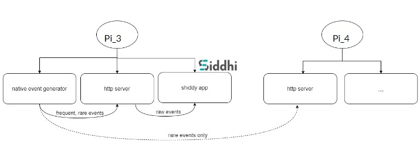
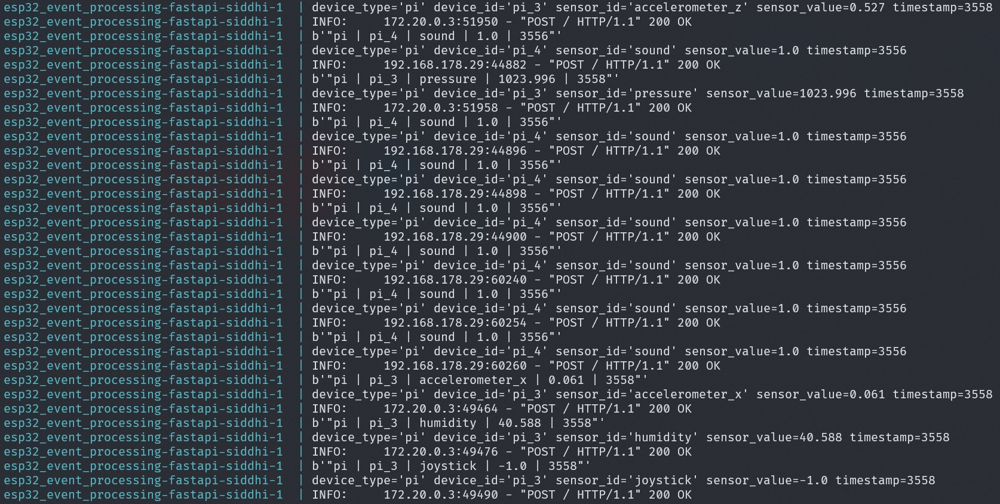

# Distributed Event Processing with Raspberry Pis

This repository holds the source code for one of the layers in a 2-tier architecture for distriuted event processing in an IoT system. The infstrastructure for the project is intended for capturing and analyzing sensor data in real time between smartwatches, on the one hand, and Raspeby Pis, on the other. The current repository focuses on the latter.


## Design

The conceptual design for the Raspberry Pi layer comprises 3 services:

- native event generator that sends out events detected by the sensors on a Raspberry Pi
- HTTP-server that listens for events generated both locally and elsewhere
- event processing application for enabling SQL-like querying of saved events



## Event Distribution

A few words have to be said about the idea behind event data processing in a distributed system and how it was handled in our use case. Although our system does not comprise dozens of devices, we still strived to minimize the processing load on each individual device and prevent network flooding. The undesirable scenario would necessarily include every device sending out every event occurring locally, which would inevitably lead to a lot of noise, data redundancy and memory shortage.

For this reason, every event type in our system is categorized as either "rare" or "frequent" and based on this specification, the "rare" events are always sent to the other devices while the "frequent" events are processed locally. This binary distinction of events into "rare" and "frequent" is a rough estimation and is based on whether data is generated by environmentally oriented sensors (e.g.orientation and angular velocity, humidity, pressure, etc.) or by a user (e.g. pressing a button, switching a toggle, producing a sound, etc.).

For example, in the current system, the "frequently" generated events such as `pressure`, `humidity` and `accelerometer_<id>` are never sent from the device of origin. Instead, they are stored and processed locally. Whereas, the "rarely" occuring events, such as `joystick` and `sound` are always exchanged between the devices.

Events coming in on the device `pi_3`:


Events coming in on the device `pi_4`:


Such a design also presupposed the concept of distributed query placement: the target query is broken down into subqueries that are evaluated "on edge" as much as possible. This allows a scenario, for example, where rare events are matched against a subquery and, when a match occurs, the events that led to this match are sent to other devices for further evaluation.

## Implementation

The obvious solution is a contenerized application (see section ... below on the problems) which ensures stable and consistent performance across the devices with different system environments.

The backbone of the architecture is, therefore, a multi-service Docker Compose stack. In this case, it's two services: (1) a service to read sensors and send events and (2) a service with an HTTP server streaming incoming events to the event processing application. The HTTP server listens to both the events generated locally, as well as those generated on other devices.

The Docker images for the [sensor reader](https://hub.docker.com/repository/docker/piankris/sensor-reader/general) and the [http-event-processor](https://hub.docker.com/repository/docker/piankris/fastapi-siddhi/general) are pre-built and readily available in the public repository on Docker Hub. The images basically provide the required environments and the dependencies, while the application itself is mounted to containers on launch as a volume. This setup offers substantial advantages for development and quick reconfiguration: any changes in the application code and/or config files does not require rebuilding the images, which takes an unacceptably long time given the Rapberry Pi computing resources and the armv7 architecture.

The system can be configured in `config.yaml` by specifying the IP addresses of the devices to enable communication between them, time intervals for sending data, event types for each devices, etc.

Another important aspect to the Docker Compose file is that it uses the previleged mode for the services in order grant launched containers root capabilities to all devices on the host system. This is required for allowing the containers to gain access to the sensors.

Lastly, both Docker images are built specifically for armv7 as the target architecture as it is used by our Raspberry Pi 4 devices. This is crucial as most of the required dependencies are not shipped as pre-built binaries for this architecture and, thus, have to be compiled from sratch. This results in extremely long build times and was the main reason behind the decision for uploading pre-built Docker images restricted to just setting the environment for the application instead of baking the application source code into the images, as well.

### Sensor Reading Service

Uses nothing more than the `sense-hat` Python library for controling the Raspberry Pi [Sense HAT](https://pythonhosted.org/sense-hat/), as well as the `GPIO` library for reading data from the General-Purpose Input/Output pins. The events are then sent to specified HTTP endpoints.

### HTTP Server with Event Processing App

This service comprised the logic of hosting an HTTP server that passes data directly to the event processing application. [`FastAPI`](https://fastapi.tiangolo.com/) framework for Python serves as the basis for the HTTP server whereas [Siddhi](https://siddhi.io/) was the choice for event processing. To integrate the FastAPI component written in Python with Siddhi, implemented in Java, we opted for the [Python wrapper for Siddhi](https://github.com/siddhi-io/PySiddhi). PUT A FOOTNOTE HERE

While Siddhi can be integrated with external data stores such as RDBMS, MongoDB, etc., the default behavior is in-memory data storage, which fits our use case. The matching query has to be specified before launching the application but, having said that, it is possible to list multiple matching queries (and subqueries) to select from for each individual device.

## Installation Guide

1. Before you start, make sure you have all the devices connected to one network, otherwise they will not be able to communicate. In order to connect a Raspberry Pi to a local network, modify its network configuration file `/etc/wpa_supplicant/wpa_supplicant.conf` by simply appending a new block to it:

```json
network={
    ssid="network_name"
    psk="network_password"
}
```

The system might requied you to use the previleged mode for modying this file. Reboot the device afterwards.

2. Clone the repository with the source code:

```bash
git clone https://github.com/Kristina-Pianykh/esp32_event_processing.git
```

3. Run the installation script for Docker:

```
./install_docker.sh
```

4. Specify the IP addresses for the connected devices in the project configuration file `config.yaml`. You can use [`Angry Scanner](https://angryip.org/), a free and open-source network scanner, to look up the addresses of all the devices connected to your local network.

5. Launch Docker Compose and specify the device ID `pi_id` as an argument:

```bash
sudo DEVICE_ID=<pi_id> docker compose up
```

The services are set up with logging. It is essential that the applications are launched on all Respberry Pi devices for the service to start sending data. Otherwise, it will be stuck in an infinite loop of waiting for the devices specified in the config to start first.


## Installation Guide (Smartwatches, out of scope)

1. Install `poetry`: [Installation Guide](https://python-poetry.org/docs/#installation).

Note: you might need to use python ^3.10.

2. Install python dependencies:

```bash
poetry install
```

3. Start the server:

```bash
poetry run poe start
```

4. Open the `./arduino/watch_event_processing` in Arduino IDE
5. Upload the sketch to the watch

## Watch Events:

1. Click event
2. Toggle event (combined with `1`)
3. Rotation events (2-dimensional)

## Run on a Pi

1. Install `Docker` and `docker compose` by running

```bash
./install_docker.sh
```

2. Start the services with

```bash
sudo DEVICE_ID=<pi_id> docker compose up
```

where `pi_id` is the ID of the current rasberry pi.

It spins up two services: (a) the fastapi http server with the event processing app Siddhi and (b) the service to reads sensor data from the pi and send it to the http server

